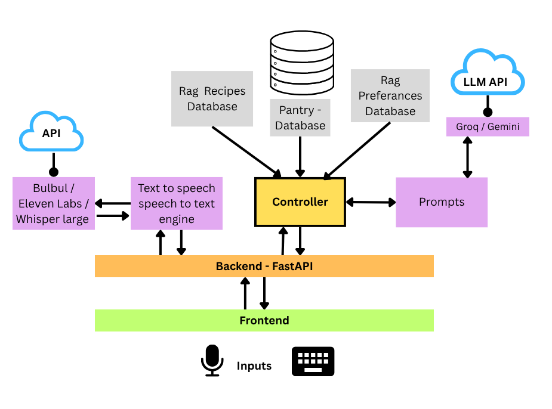

# Rag Based Smart Kitchen Assistant

An intelligent, stateful, and voice-enabled cooking companion built with **Retrieval-Augmented Generation (RAG)**, **Large Language Models (LLMs)**, and a custom stateful cooking orchestration engine. 

Unlike static recipe chatbots, this system is an interactive partner. It retrieves recipes from a massive culinary database, personalizes them to your dietary needs and pantry inventory, and guides you step-by-step through the cooking process—handling mid-cook substitutions and questions in real-time.

---

## Architecture

1. **Frontend (Interface Layer):** A vanilla HTML/CSS/JS web application featuring a chat interface, dynamic step-by-step cooking panels, a sliding pantry management drawer, and WebRTC-based voice recording.
2. **Backend (FastAPI):** Exposes REST endpoints (`/chat`, `/chat/voice`, `/next-step`, `/pantry`) to handle all client requests.
3. **Control Layer (State Machine):** A custom Python controller (`controller.py`) that manages session memory and transitions between `IDLE`, `INGREDIENT_CONFIRM`, and `COOKING`.
4. **Intelligence Layer (LLM Router):** A multi-tier LLM client. It routes fast, simple tasks (intent classification, extractions) to **Groq (Llama 3.3 70B)**, and complex reasoning tasks (recipe generation, personalization) to **Gemini 2.0 Flash**.
5. **Retrieval Layer (RAG):** Uses `sentence-transformers` and ChromaDB to semantically fetch recipes.
6. **Data Layer:** SQLite for strict inventory/pantry tracking, and ChromaDB for soft behavioral preference tracking.

---

## Key Features

* **Zero-Latency Step Advancement:** During a cooking session, pressing "Enter" or saying "Next Step" advances the recipe using purely local state logic **(0 LLM calls)**. This ensures zero latency when your hands are full.
* **Pantry-Aware Personalization:** Before starting a recipe, the system cross-references the ingredients with your SQLite pantry, alerts you to missing items, and offers context-aware substitutions.
* **Dual-Memory Preference Tracking:**
  * *Hard Preferences (SQLite):* Dietary restrictions, spice levels, allergies.
  * *Soft Preferences (ChromaDB):* Behavioral habits extracted dynamically by the LLM (e.g., "User prefers air-frying over deep-frying").
* **Voice-First Interaction:** Integrated Speech-to-Text via **Groq Whisper Large V3** and Text-to-Speech via **Edge TTS** (with support for Sarvam Bulbul for Indian/Hinglish contexts). 

---

## Working

1. **`IDLE` Mode:** The default state. The orchestrator classifies user input into one of 13 intents. The user can add items to the pantry, ask for meal suggestions based on available ingredients, or chat generally.
2. **`INGREDIENT_CONFIRM` Mode:** Triggered when the user asks to cook a dish. The system performs RAG retrieval, personalizes the recipe, compares it against the SQLite pantry using fuzzy name matching, and lists missing ingredients. It waits in this state until the user confirms they are ready.
3. **`COOKING` Mode:** The system guides the user one step at a time. 
   * **Fast Path:** Blank inputs (Enter) or "Next" trigger the `advance_step` method instantly (0 LLM calls).
   * **LLM Path:** Keyword detection for phrases like "missing" or "don't have" routes to a targeted LLM call to suggest a substitute based on the *current* step's context.

---

## RAG Database Creation Process

1. **Datasets Used:** * Indian Food Dataset (250+ traditional recipes).
   * Nutritional Values Dataset.
   * Multi-Cuisine Recipes Dataset (20+ international cuisines).
   * INDORI Dataset (street food).
   * RecipeNLG Subset (50,000 records).
   * Indian Recipes with Detailed Nutrition.
2. **Data Cleaning & Standardization:** Using Pandas, the datasets were loaded, cleaned, and normalized. Records with incomplete steps or missing ingredients were purged.
3. **Fuzzy Matching Integration:** To enrich the recipes, nutritional data was mapped to specific recipes using fuzzy string matching via the `rapidfuzz`.
4. **Chunking Strategy:** Each recipe was consolidated into a single, cohesive text chunk containing the dish name, description, exact ingredients, and step-by-step instructions to preserve full context during retrieval.
5. **Embedding & Storage:** The chunks were embedded using the `all-MiniLM-L6-v2` sentence-transformer model and stored locally in a **ChromaDB** collection (`indian_recipes`). The final production database contains **11,577 high-quality recipe documents**.

*(Note: A secondary Knowledge Base was also constructed from 7 culinary science books, such as "Masala Lab" and "Salt Fat Acid Heat", chunked using PyMuPDF to answer fundamental food science queries but due the problems faced during chunking and retrieval plus I didn't think this would actually help the system I did not use it.)*.

---

## Tech Stack

| Component | Technology | Purpose |
| :--- | :--- | :--- |
| **Backend Framework** | FastAPI, Uvicorn | REST APIs, Audio handling |
| **Fast LLM Tier** | Groq (Llama 3.3 70B) | Intent routing, extractions |
| **Quality LLM Tier** | Google Gemini (2.0 Flash) | Recipe generation, personalization |
| **Vector Database** | ChromaDB (>= 0.5.0) | Storing recipes & soft preferences |
| **Embeddings** | `sentence-transformers` (`all-MiniLM-L6-v2`) | Dense semantic search |
| **Relational Database** | SQLite | Pantry inventory & hard preferences |
| **Voice (STT / TTS)** | Whisper Large V3 (Groq) / Edge TTS | Real-time audio interaction |
| **Frontend UI** | HTML5, CSS3, Vanilla JS | Interactive Chat & Pantry UI |

---

